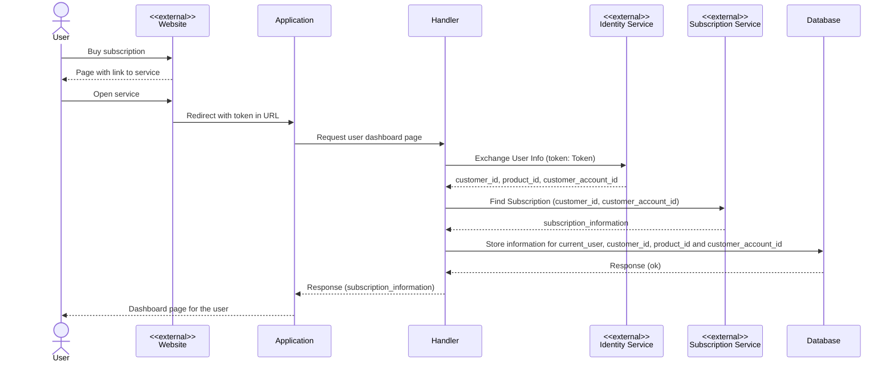

{: .box-warning }
Using brief examples may suffice to introduce a concept because the explanation is short and easy to follow.
However, short examples might leave us wondering, "What if we had to use error modeling in a real-world problem?"

## Introduction

Exploring options is the first [step]() to model errors,
but nothing provides more clarity than a concrete example.

Unfortunately _real-world problems_ and _real-world domains_ are more complex and therefore, harder to explain. In the next section, I will introduce a _real-worldish_ kind of problem that I will explore in this article.


### Subscription validation

For the problem today I am going to use a _function_ to validate a user subscription to let a user
access an online service I am offering in an online marketplace.

The flow starts when a user decides to _buy_ a subscription and gets redirected to the actual service. I am the
owner of the service and I need to identify the user and make sure the _subscription_ is active before granting access to
the main dashboard. The interaction is depicted in the following sequence diagram.
Please note that the _external_ components are identified with the label `<<external>>` and only the scenario where the user has an active subscription is included without considering any possible errors:




## Error analysis

Errors depend on context. Who decides what is an error and what is not? Was the error _expected_ or _unexpected_? We discussed
these [ideas in the previous post](#modeling-expected-failure) exploring _pure_ and _impure_ functions.

Here is the first version of the code without any error modeling and handling. This is a good to start to identify points of failure:


{: .box-note}
Across the code, I will use type hints sometimes to make types and functions clear.


```python
def request_handler(request: Request):
    """
    Uses the token passed in the url to fetch the user information,
    finds an active contract and updates the database with the user information for future use.
    Returns a valid subscription or an error that is TBD
    """

    token = extract_token_from_url(request.url)

    customer_info = exchange_customer_information(token)

    active_subscription = fetch_subscription(customer_info)

    persist_customer_information(customer_info)

    return redirect_to_dashboard(active_subscription)
```

And here is the same code with comments highlighting possible sources of errors:


```python
def request_handler(request: Request):
    """
    Uses the token passed in the url to fetch the user information,
    find an active contract and update the database with the user information for future use.
    Returns a valid subscription or an error that is TBD
    """

    # What if the token is not present?
    # Is there a minimum size or particular shape the token must adhere to?
    token = extract_token_from_url(request.url)

    # API call can fail with invalid or expired credentials
    # Also there could be other HTTP errors
    customer_info = exchange_customer_information(token)

    # API call can fail same as before
    # Also the subscription may not exist
    # Or the subscription can be expired
    active_subscription = fetch_subscription(customer_info)

    # Connection errors or db errors can happen here
    persist_customer_information(customer_info)

    # Pure function, only converts the subscription into a response
    return redirect_to_dashboard(active_subscription)
```

The following table summarizes the possible errors for the flow depicted above:

| Function                    | Error Scenario           |
| `extract_token_from_url`    | Token missing or invalid |
| `exchange_customer_information` | Credentials missing  |
| ^^                          | ^^ Credentials expired   |
| ^^                          | ^^ Arguments invalid     |
| ^^                          | ^^ Invalid response      |
| ^^                          | ^^ Unknown error         |
| `fetch_subscription`        | Credentials missing      |
| ^^                          | ^^ Credentials expired   |
| ^^                          | ^^ Arguments invalid     |
| ^^                          | ^^ Invalid response      |
| ^^                          | ^^ Unknown error         |
| ^^                          | Subscription not found   |
| ^^                          | Subscription expired     |
| `persist_customer_information` | Unknown error           |
| Any other error             | Unknown error            |

Let us think about what information is needed for each error and how it affects the response from the handler.

From the telemetry point of view, when an _unexpected_ error happens, having information that could help diagnose what the problem was will be useful. All the _unexpected_ errors should be _logged_, with enough context to understand what happened. For example, if the response of an API does not conform to the expected schema logging only a message such as `"Schema validation error"` is not enough to determine which API was called nor what the problem was.

Logging extra information could be useful. But to define the response, we need to think from the user's perspective.

Showing errors that are completely disconnected from the current activity (like an API validation error or a database error) may confuse the user. Only expected errors must show notices, like issues with the subscription or problems with the token sent from the marketplace website. Any other error that is not related to the subscription or the token will be shown as a generic message without details.


The response, if an error happens, will be a _redirect_ to the landing page, including in the URL an error code that indicates to the caller what happened.

Here is the same table as above, but now including the response in the last column:

| Function                    | Error Scenario           | Redirect Response |
| extract_token_from_url      | Token missing or invalid | Token missing or invalid |
| exchange_customer_information | Credentials missing      | Generic error |
| ^^                          | ^^ Credentials expired   | ^^ |
| ^^                          | ^^ Arguments invalid     | ^^ |
| ^^                          | ^^ Invalid response      | ^^ |
| ^^                          | ^^ Unknown error         | ^^ |
| fetch_subscription          | Credentials missing      | Generic error |
| ^^                          | ^^ Credentials expired   | ^^ |
| ^^                          | ^^ Arguments invalid     | ^^ |
| ^^                          | ^^ Invalid response      | ^^ |
| ^^                          | ^^ Unknown error         | ^^ |
| ^^                          | Subscription not found   | Subscription not found |
| ^^                          | Subscription expired     | Subscription expired   |
| persist_customer_information | Unknown error            | Generic error |
| Any other error             | Unknown error            | Generic error |


## Modeling errors using exceptions

Let us tackle one [function](#and-here-is-the-same-code-with-comments-highlighting-possible-so) at a time:


### extract_token_from_url

| Function               | Error Scenario           | Redirect Response |
| extract_token_from_url | Token missing or invalid | Token missing or invalid |

<pre></pre> <!-- to leave some space -->
```python
class TokenNotPresent(Exception):
  """
  The token is missing from the URL
  """
  pass

class ValidationError(Exception):
  """
  This is an exception from a library like [Pydantic](https://docs.pydantic.dev/latest/)
  """
  pass


def request_handler(request: Request):
    # What if the token is not present?
    # Is there a minimum size or particular shape the token must adhere to?
    try:
      token = extract_token_from_url(request.url)
    except TokenNotPresent:
      logger.info("The URL token parameter was not present in", request.url)
      return redirect_with_error("TokenMissing")
    except ValidationError:
      logger.error("The URL token was present, but the length was invalid", request.url)
      return redirect_with_error("TokenInvalid")

    # ... the rest of the code
```

{: .box-warning }
Maybe instead of using `ValidationError` we could create a custom `TokenInvalid` exception...

### exchange_customer_information

| Function                    | Error Scenario           | Redirect Response |
| exchange_customer_information | Credentials missing      | Generic error |
| ^^                          | ^^ Credentials expired   | ^^ |
| ^^                          | ^^ Arguments invalid     | ^^ |
| ^^                          | ^^ Invalid response      | ^^ |
| ^^                          | ^^ Unknown error         | ^^ |

The _external marketplace_ service offers a library for Python to call the services. I will use the `external_client` variable to have an instance of the _client_ to call the APIs.


```python
CustomerId = str

ProductCode = str

CustomerAccountId = str

@dataclass
class CustomerInformation:
  customer_id: CustomerId
  customer_account_id: CustommerAccountId
  product_code: ProductCode

class ExternalApiError(Exception):
  pass

class UnknownError(Exception):
  pass

def exchange_customer_information(token):

  try:
    response = external_client.exchange_customer_information(token)
    # This will throw a validation error
    return validate_customer_exchange_schema(response)
  except ClientError as e:
    error_code = e.response["Error"]["Code"]
    match error_code:
      case "ExpiredCredentials":
        raise ExternalApiError(error_code="expired_credentials") from e
      case "InvalidCredentials":
        raise ExternalApiError(error_code="invalid_credentials") from e
      case "InvalidParameter":
        raise ExternalApiError(error_code="invalid_parameter") from e
      case _:
        raise ExternalApiError() from e
  except Exception as e:
      raise UnknownError() from e


def request_handler(request: Request):
  # The token was extracted from the request

  try:
    customer_info = exchange_customer_information(token)
  except ValidationError as val_error:
    logger.error("There was a problem with the response schema of the exchange user information API", val_error)
    return redirect_with_error("InternalError")
  except ExternalApiError as external_e:
    logger.error("There was a problem calling the exchange user information API", external_e)
    return redirect_with_error("InternalError")
  except UnknownError as unknown:
    logger.error("There was an unknown problem calling the exchange user information API", unknown)
    return redirect_with_error("UnknownError")

    # ... the rest of the code
```

{: .box-danger}
We are converting `ClientError` into another exception, but we do not use it. It is logged and then returned as an internal error.

{: .box-warning}
The handler knows that `exchange_customer_information` will throw a `ValidationError`. This creates coupling with the implementation of the function. A better idea could be to capture the error with a more meaningful exception. Unfortunately that also means extra work.

### fetch_subscription

| Function            | Error Scenario           | Redirect Response |
| fetch_subscription  | Credentials missing      | Generic error |
| ^^                  | ^^ Credentials expired   | ^^ |
| ^^                  | ^^ Arguments invalid     | ^^ |
| ^^                  | ^^ Invalid response      | ^^ |
| ^^                  | ^^ Unknown error         | ^^ |
| ^^                  | Subscription not found   | Subscription not found |
| ^^                  | Subscription expired     | Subscription expired   |

Similarly to the previous function, the `ClientError` will be converted to `ExternalApiError`.


```python
def validate_subscriptions_schema(data):
  """
  Validates the response data matches the expected schema.
  Raises a `ValidationError` when the schema does not match.
  """
  pass


def find_active_subscription(customer_info, subscriptions):
  """
  Finds a subscription that is active (i.e. end date is in the future) for the specified product
  Raises `SubscriptionMissing` when there are no subscriptions or `SubscriptionExpired` if there is no active subscription.
  """
  pass


def fetch_subscription(customer_information):

  try:
    response = external_client.fetch_subscriptions(customer_information)
    # This will throw a validation error
    subscriptions = validate_subscriptions_schema(response.data)

    # Will raise SubscriptionExpired or SubscriptionMissing
    return find_active_subscription(customer_info, subscriptions)
  except ClientError as e:
    # same as previous function
  except Exception as e:
    raise UnknownError() from e


def request_handler(request: Request):
  # The token was extracted from the request
  # The customer information was obtained

  try:
    active_subscription = fetch_subscription(customer_info)
  except SubscriptionMissing:
    logger.error("There are no subscription for the product", customer_info.product_code)
    return redirect_with_error("SubscriptionMissing")
  except ValidationError as val_error:
    logger.error("There was a problem with the response schema of the fetch subscription API", val_error)
    return redirect_with_error("InternalError")
  except ExternalApiError as xae:
    logger.error("There was a problem calling fetching subscriptions API", xae)
    return redirect_with_error("InternalError")
  except UnknownError as unknown:
    logger.error("There was an unknown problem calling fetching subscriptions API", unknown)
    return redirect_with_error("UnknownError")

    # ... the rest of the code
```

### persist_customer_information

| Function                    | Error Scenario           | Redirect Response |
| persist_customer_information | Unknown error            | Generic error |

Last but not least, we need to check if there are errors calling the database:

```python
def persist_customer_information(customer_info):
  """
  Stores the customer information into the database for future usage
  """
  pass


def request_handler(request: Request):
  # The token was extracted from the request
  # The customer information was obtained
  # The active subscription was found

  try:
    persist_customer_information(customer_info)
  except Exception as db_e:
    logger.error("There was a problem calling the database", db_e)
    return redirect_with_error("UnknownError")

  return redirect_with(active_subscription)
```

## Modeling errors using the `Either` type

Let us explore in [contrast](#modeling-failures-with-types) how using the `Either` type from [pymonad](https://github.com/jasondelaat/pymonad) can help us model errors in a more succinct and declarative way.

Please, if you are not familiar with the `Either` type, check the previous post and read the examples on the _pymonad_ site.

I want to also address some points:

* The code started quite simple but became convoluted and harder to read with all the exception handling.

* The code is wrapping exceptions to identify errors, but the actual code is not used, and the new exception does not provide extra data.

* The code is using exceptions to model a missing subscription when that is a valid result, nothing exceptional.

I like how the code reads in the first version without highlighting errors:


```python
def request_handler(request: Request):
    token = extract_token_from_url(request.url)

    customer_info = exchange_customer_information(token)

    active_subscription = fetch_subscription(customer_info)

    persist_customer_information(customer_info)

    return redirect_to_dashboard(active_subscription)
```

This looks like a chain of functions because each function _kind of_ uses the previous result.

If we change each function to return an instance of `Either[Error, Value]` perhaps we could achieve something like this:


```python
def request_handler(request: Request):
  return extract_token_from_url(request.url) \
    .then(exchange_customer_information) \
    .then(fetch_subscription) \
    .then(persist_customer_information) \  # We wil fix this later
    .either(redirect_to_landing_with_error, redirect_to_dashboard)

```

The `.either` function will call `redirect_to_landing_with_error` with the _left_ value or `redirect_to_dashboard` with the _right_ value.

### `extract_token_from_url`

Being a pure function, there is no need to deal with exceptions; we just need to model the actual errors.

Python provides a [Literal](https://typing.readthedocs.io/en/latest/spec/literal.html#literal-types) type to represent specific values.

```python
Token = str

ExtractTokenError = Literal['TokenMissing', 'TokenInvalid'] # same as a union

def extract_token_from_url(url) -> Either[ExtractTokenError, Token]:
  """
  Returns a `Right[Token]` if the token is present and valid or `Left[ExtractTokenError]` if not
  """
  pass

```

#### Working with impure functions

Often when working with side effects, a pattern appears where exceptions must to be translated into types. For our example, that means that code that can throw an `Exception` needs to be converted into an `Either[L, R]`.

Imagine a scenario where an impure function is called; the code may look like this:

```python
def very_common_scenario(input: T) -> Either[Exception, T]:
  try:
    return Either.insert(impure_function(input))
  except Exception as ex:
    return Left(ex)
```

Or we could extract the general pattern into:

```python
def either_try_fn(some_fn: Callable[[], T]) -> Either[Excception, T]:
  try:
    return Either.insert(some_fn())
  except Exception as ex:
    return Left(ex)
```

Sometimes working with `Exception` on the _left_ will be enough, but not always it will be a good fit. We could extend the
function to also take a function to _optionally_ convert the exception to a different type. By default, we could use the identity
function and return the same exception.


```python
def either_try_fn(some_fn: Callable[[], T], left_fn: Callable[[], L] = lambda ex: ex) -> Either[Excception, T]:
  try:
    return Either.insert(some_fn())
  except Exception as ex:
    return Left(left_fn(ex))
```

This is nice, but let us develop the idea a bit further. Thinking in a _pythonic_ frame of mind, we could just use regular functions and add a decorator that will convert the function result to `Either`.

```python
def either_try(left_fn: Callable[[Exception], L] = lambda e: e):
    """
    Decorator that wraps a function and returns an Either type.
    It takes an optional function to convert the _left_ side. By default is the identity function.
    """

    def decorator_try_either(func):
        @wraps(func)
        def wrapper(*args, **kwargs):
            return either_try_fn(lambda: func(*args, **kwargs), left_fn)

        return wrapper

    return decorator_try_either

```

We are going to use this in the next section.

### exchange_customer_information

To avoid wrapping the exception with another exception that contains the _exact_ same information, we are going to use `ClientError` as a possible _left_ value.
Though it simplifies the code, this decision exposes the use of the service API to the caller, creating _coupling_ between the _caller_ and the _callee_.

To identify which validation failed, we are going to add _context_ to the invalid schema error.

{: .box-note}
The `curry` decorator creates a function that can be called with fewer arguments and returns another function. Please take a look at the [Toolz library](https://toolz.readthedocs.io/en/latest/curry.html?highlight=curry#the-curried-namespace) documentation to learn more.

```python
@dataclass
class InvalidApiSchema:
  """
  Represents an error when the response doesn't match the expected schema.
  The `context` helps to understand which API was called.
  """
  context: str
  ex: Exception


ApiCallError = ClientError | InvalidApiSchema


@curry
def to_api_call_error(context: str, ex: Exception) -> ApiCallError
  """
  Converts a `ValidationError` using the context and passes along all the other exceptions
  """
  match ex:
    case ex is ValidationError: return InvalidApiSchema(context, ex)
    case _: return ex


@either_try(to_api_call_error('Exchange customer information'))
def exchange_customer_information(token) -> Either[ApiCallError, CustomerInformation]:

  response = external_client.exchange_customer_information(token)

  return validate_customer_exchange_schema(response)
```

### fetch_subscription

The implementation could reuse what we created for the implementation of the previous function but we need to address two more error scenarios: the subscription is missing or expired.

```python
@dataclass
class Subscription:
  product_code: ProductCode
  customer_id: CustomerId
  expiration_date: Date


@dataclass
class ExpiredSubscription:
  expiration_date: Date

MissingSubscription = Literal['MissingSubscription']

SubscriptionError = ExpiredSubscription | MissingSubscription


@either_try(to_api_call_error('Fetch subscription for customer'))
def fetch_subscription(customer_info: CustomerInformation) -> Either[ApiCallError | SubscriptionError, Subscription]:

  response = external_client.fetch_subscriptions(customer_info.customer_id, customer_info.customer_account_id)

  subscriptions = validate_subscriptions_schema(response.data)

  # Find first the subscription with the right product code
  gen = [s for s in subscription if s.product_code == customer_info.product_code]

  match next(gen, None):
    case None: return Left('MissingSubscription')

    case found if found.expiration_date < dt.datetime.now(pytz.utc): return Left(ExpiredSubscription(found.expiration_date))

    case found: return Either.insert(found)

```

### Saving the info to the database

The last function that we need to implement has to store the customer information in the database:

```python
@either_try
def persist_customer_information(user_id: UserId, customer_info: CustomerInformation) -> Either[Exception, None]:
  """
  Stores the information into the database for future usage
  Any `Exception` is captured as a `Left` side.
  """
```

The problem is that we need the current user ID (the user logged in to the application) and the customer information.

This change in types breaks the _chaining_ pattern we were hoping to implement because the output of fetching the active subscription does not include the customer information.

I could change the order of the functions and _persist the information_ before confirming a valid subscription exists.
From the _flow_ point of view, the association between user ID and customer information should not change.
That will require a small change in the order of the calls and the result of the function, something like this:

```python
@either_try
def persist_customer_information(user_id: UserId, customer_info: CustomerInformation) -> Either[Exception, CustomerInformation]:
  # do some storing here
  return customer_info


def request_handler(request: Request):
  return extract_token_from_url(request.url) \
    .then(exchange_customer_information) \
    .then(persist_customer_information) \
    .then(fetch_subscription) \
    .either(redirect_to_landing_with_error, redirect_to_dashboard)
```

An alternative to this approach would be to modify the function to use `tap`. Using `tap` combines two computations, but
ignores the result of the second. This comes in quite handy for _side effects_.

```python

def request_handler(request: Request):
  return extract_token_from_url(request.url) \
    .then(exchange_customer_information)     \
    .tap(persist_customer_information(request.current_user)) \ # Does persistance but will keep left side if it fails
    .then(fetch_subscription)                \
    .either(redirect_to_landing_with_error, redirect_to_dashboard)
```

That works. However, storing information for a customer who has no subscription could be seen as a disadvantage.

To avoid that, we could extract a utility function that both fetches the subscription and stores the customer information:


```python
FetchAndPersistError = ApiCallError | SubscriptionError | Exception

@either_try
@curry
def fetch_subscription_and_persist_customer(user_id: UserId, customer_info: CustomerInformation) -> Either[FetchAndPersistError, Subscription]:
  return fetch_subscription(customer_info) \
    .tap(lambda _: persist_customer_information(user_id, customer_info))


def request_handler(request: Request):
  return extract_token_from_url(request.url)   \
    .then(exchange_customer_information)       \
    .then(fetch_subscription_and_persist_customer(request.current_user)) \
    .either(redirect_to_landing_with_error, redirect_to_dashboard)
```

### Redirecting to landing

No matter which side of the `Either` the result is, the response will be a _redirect_.
We can use that idea to create a function that can be reused:

```python
Page = Literal['Landing', 'Dashboard']

def redirect_to(page: Page, data: Dict[str, Any]) -> Response :
  """
  Creates a reponse that redirects to the specified `page` using a dictionary to pass
  parameters encoded in the URL
  """
  pass

```

We can reuse `redirect_to` in both paths to convert the information to pass in the URL to a `Dict`.


```python
"""
Expanded would be =
   ClientError             |
   Exception               |
   ExpiredSubscription     |
   InvalidApiSchema        |
   Literal['TokenInvalid'] |
   Literal['TokenMissing'] |
   MissingSubscription
"""
OhMyAnError = ExtractTokenError | FetchAndPersistError


def error_to_dict(error: OhMyAnError) -> Dict[str, Any]:
  """
  Maps the error to a dictionary.
  For `Exception` returns an unknown error because we are not sure what happened
  For the subscription errors returns the associated code and extra information if needed
  For any other error, because is either validation or a problem with the API returns an internal error
  """
  def to_map(error_code, **kwargs):
    return {"error_code": error_code, **kwargs}


  match error
    case is Exception: return to_map("UnknownError")
    case is ExpiredSubscription as expired: return to_map("ExpiredSubscription", "expiry_date": expired.expiration_date)
    case 'MissingSubscription': return to_map('MissingSubscription')
    case _: return to_map("InternalError")


def log_the_error(error) -> Either[None, None]:
  """
  Logs the error using the information encoded in the arguments.
  All exceptions will be logged with stacktrace, etc.
  Subscription errors will be logged indicating expiration date.
  Client (API) errors will be logged indicating which API was called.
  Invalid schema errors will log also the API that was called and what was returned.
  """
  pass


def request_handler(request: Request):
  return extract_token_from_url(request.url)   \
    .then(exchange_customer_information)       \
    .then(fetch_subscription_and_persist_customer(request.current_user)) \
    .tap_left(log_the_error) \
    .either(
      lambda error: redirect_to('Landing', error_to_dict(error)),
      lambda subscription: redirect_to('Dashboard', {"expiration_date": subscription.expiration_date})
    )
```


## Summary

I see the following benefits when using the `Either` type:

* The code is very declarative and optimized for readability.
* The function flow is clear, easy to follow.
* Each function has explicit errors, forcing the caller to handle result if it is an error.
* All errors are handled and the responses coincide with the [error analysis](#error-analysis) done at the beginning.
* The code uses exceptions as errors when convenient; no need to create extra exceptions.
* Logging is handled in a central place without extra effort.
* Changing how the errors should be converted to a response is a simple change.


And we are done! Phew! Is it _real-world_ enough for you?
